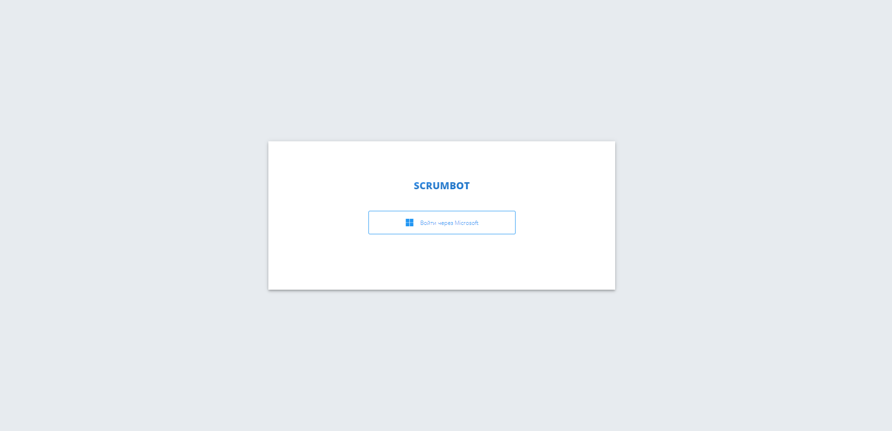
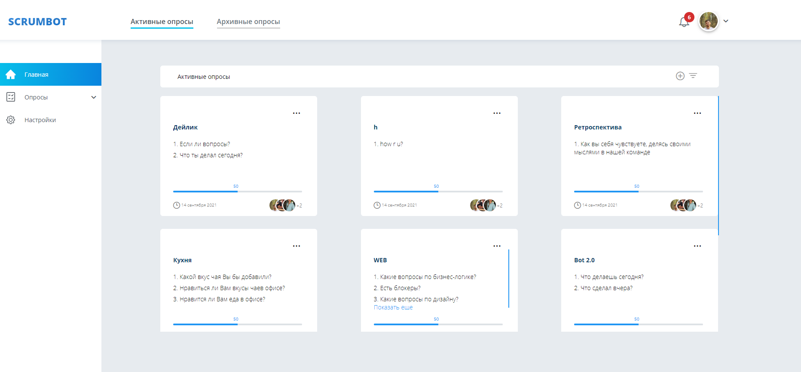
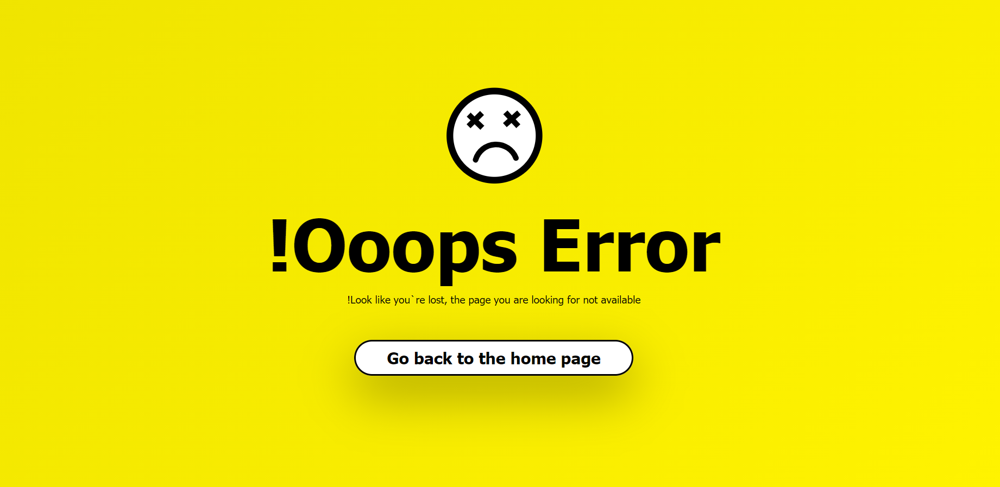
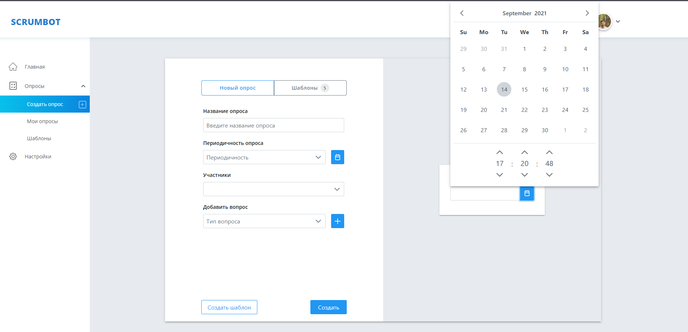
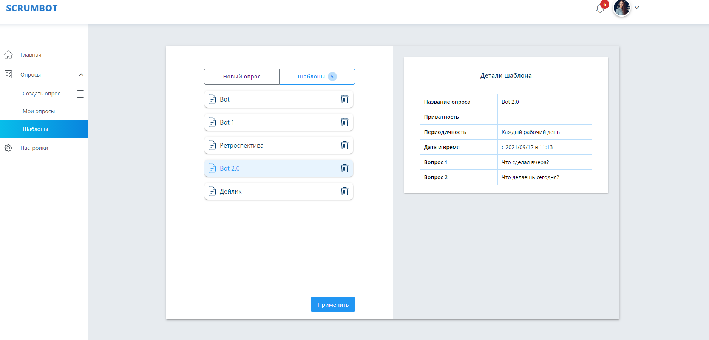
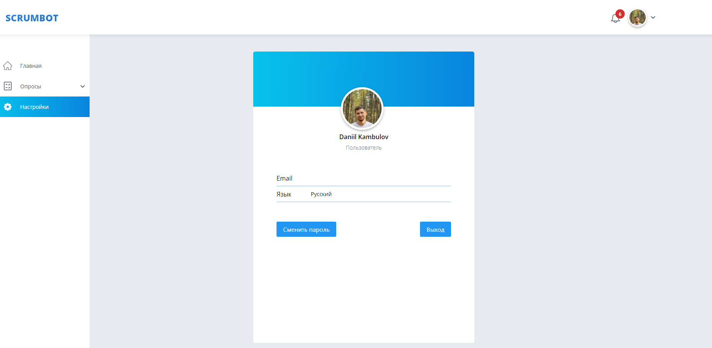

# ScrumBot
Данный веб интерфейс позволяет проводить опросы среди сотрудников компании. Опросы отправляются в тимс указанным участникам. На сайте представлена возможность создавать, просматривать, редактировать, архивировать опросы. Просматривать статистику, а также сами ответы пользователей и т.д

В работе использовался (ReactJS, TypeScript, NodeJS, PostgresSQL, StoryBook, NestJS, Redux Toolkit)

